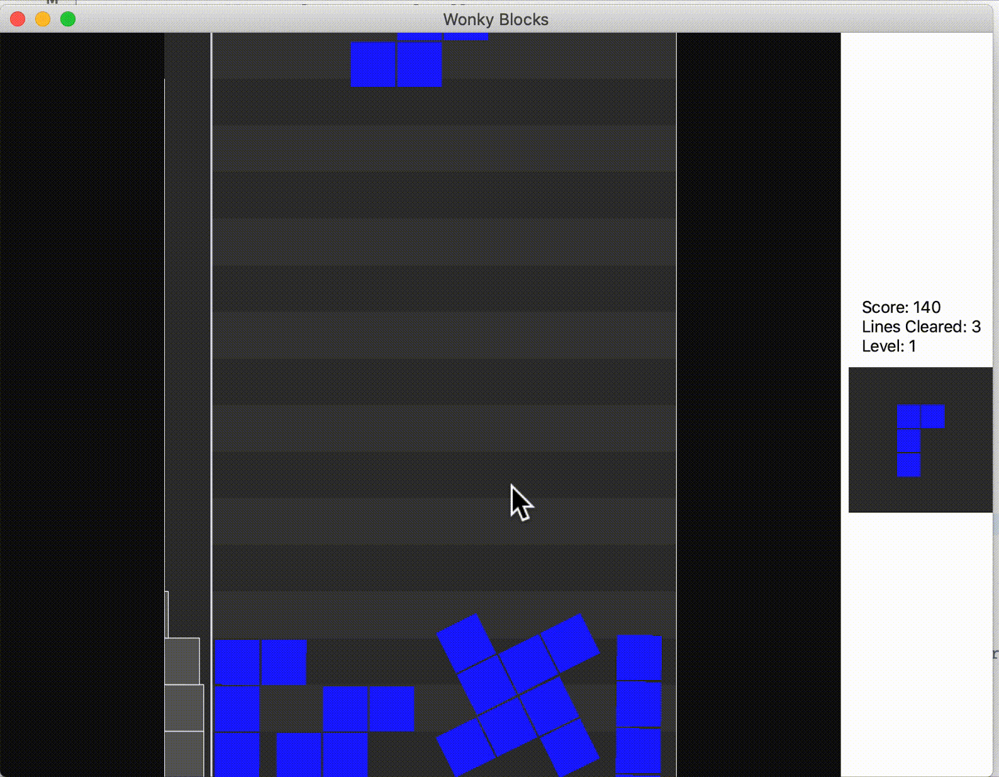

#  Wonky Blocks

Inspired by [Not Tetris 2](https://stabyourself.net/nottetris2/), made for Apple platforms using SpriteKit and SwiftUI.

> It's got all the upsides of Tetris and all the downsides of physics

## How to Play
Your goal is to last as long as possible without letting the pile reach the top of the board by removing as many lines as possible. A line is removed when the area of pieces in the row is high enough. Gain more points by removing multiple lines at once. Unlike normal Tetris, pieces do not rotate in 90 degree increments or fall one line at a time.

### Mac and iPad (with Keyboard)
_Z_ and _X_ keys rotate left and right. Arrow keys move the piece. 

### iPhone and iPad (without Keyboard)
Use the two touch joysticks. The left joystick moves the piece, and the right joystick rotates the piece.

### Game Controllers
Game controllers are also supported on all platforms
